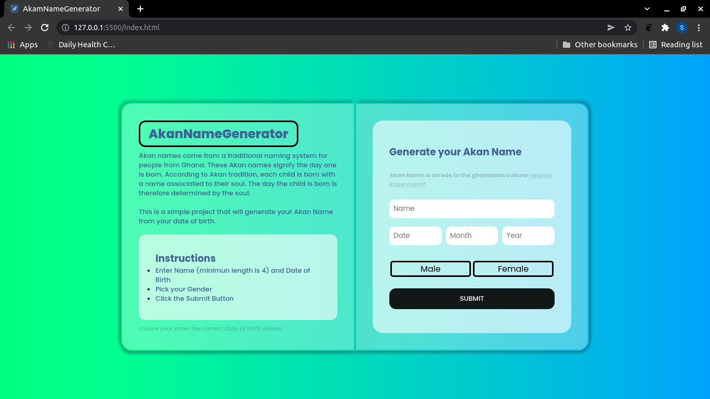

# akanNameGenerator
AkanNameGenerator project. Built with Javascript.

## Table of contents
  - [Table of contents](#table-of-contents)
    - [Screenshot](#screenshot)
    - [Project Description](#Project-description) 
    - [Links](#links)
    - [Built with](#built-with)
    - [Contact Information](#contact-information)
    - [License & Copywright Information](#License-and-Copywright-Information)
  - [Author](#author)

---
___

### Screenshot

___
---
### Project Description

What is an Akan Name?\
Akan names come from a traditional naming system for people from countries such as Togo, Ivory Coast and Ghana. A child’s name is determined by factors surrounding his or her birth. For example, the day of their birth or the manner in which they were born may determine which name they get irrespective of their gender. These Akan names signify the day one is born. According to Akan tradition, each child is born with a name associated to their soul. The day the child is born is therefore determined by the soul.

What is the Project About?\
The project is just simple akan name generator that calculates the day of the week you were born and gives what would be your Akan Name if you were born in Ghana or west of Africa.

How does it work?\
You simply add your name and date of birth, then pick your gender and click the submit button. It will then generate your day of birth e.g(Monday, tuesday e.t.c) then give you your Akan Name respective of that.

**NB** Your Date of birth should be written in the correct format or else you will pass the validity checks.

---
___
### Links

- Live Site URL: [AkanNameGenerator](https://lemmymwaura.github.io/akanNameProject/)

---
___
### Built with / Technologies Used

- Semantic HTML5 markup
- CSS custom properties
- Flexbox
- Grid
- Javascript (Vanilla)
  ```javascript
  //Example
    switch (day) {
    case 0:
      return "you was born on a Saturday your Akan Name is Ama"
  ```
---
___
### Contact Information
---
___
### License and Copywright Information
---
___
## Author 

- Website - [lemmyMwaura](https://lemmymwaura.github.io/akanNameProject/)
- Github - [@lemmyMwaura](https://github.com/LemmyMwaura)
---
___