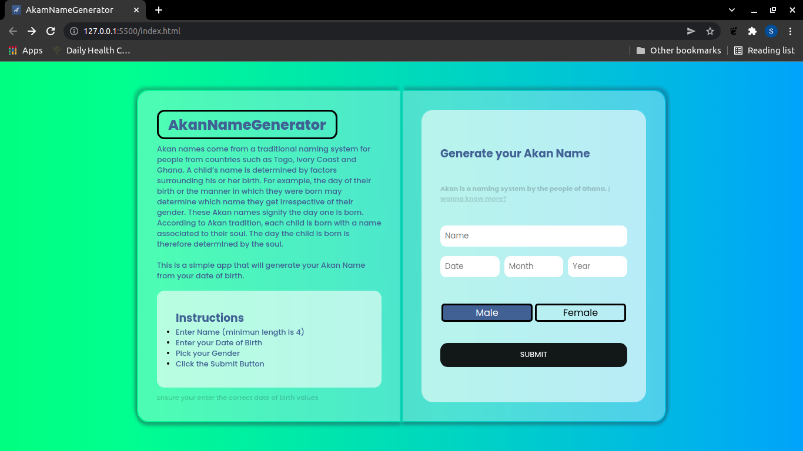

# akanNameGenerator
AkanNameGenerator project. Built with Javascript.

## Table of contents
  - [Screenshot](#screenshot)
  - [Project Description](#Project-description) 
  - [Links](#links)
  - [Built with](#built-with)
  - [Contact Information](#contact-information)
  - [License & Copywright Information](#License-and-Copywright-Information)
  - [Author](#author)

---
___

### Screenshot

___
---
### Project Description

What is an Akan Name?\
Akan names come from a traditional naming system for people from countries such as Togo, Ivory Coast and Ghana. A child’s name is determined by factors surrounding his or her birth. For example, the day of their birth or the manner in which they were born may determine which name they get irrespective of their gender. These Akan names signify the day one is born. According to Akan tradition, each child is born with a name associated to their soul. The day the child is born is therefore determined by the soul.

What is the Project About?\
The project is just simple akan name generator that calculates the day of the week you were born and gives what would be your Akan Name if you were born in Ghana or west of Africa.

How does it work?\
You simply add your name and date of birth, then pick your gender and click the submit button. It will then generate your day of birth e.g(Monday, tuesday e.t.c) then give you your Akan Name respective of that.

**NB** Your Date of birth should be written in the correct format or else you will not pass the validity checks.

---
___

### BDD
 #### Context
   Given that the user adds his date of birth and name\
      And the date is valid\
      And the month is valid\
      And the year is valid\
      And the gender was selected
 #### Event
  When the User clicks the submit button
#### Outcomes
  Then the app should display the Akan name depending on their gender with a greeting.\
  And the app should refresh.

* [x] User Inputs Date of birth Name and selects Gender (all recquired)
* [x] Submit button Starts the app.
* [x] Date of birth validity are done.
* [x] Akan Name is generated depending on gender and day of birth
* [x] Alert with the Akan Name and a greeting is displayed to the user.
---
___
### Links

- Live Site URL: [AkanNameGenerator](https://lemmymwaura.github.io/akanNameProject/)

---
___
### Built with / Technologies Used

- Semantic HTML5 markup
- CSS custom properties
  - Flexbox
  - Grid
  - Media Queries (Mobile responsive)
- Javascript (ES6+)
  ```javascript
  //Example
  //Get day Function
    return Math.trunc(
    (CC / 4 - 2 * CC - 1 + (5 * YY) / 4 + (26 * (MM + 1)) / 10 + DD) % 7
  )
  ```
---
___
### Contact Information

| Name   | Email               |
|--------|---------------------|
| Email  | lemmymwaura@gmail.com |
| Twitter| lemmyMwaura |
| Github | [lemmyMwaura](https://github.com/LemmyMwaura) |
---
___
### License and Copywright Information
(c) Stephen Lemmy Mwaura, Software Engineer.

Licensed under the [MIT License](LISENCE)
---
___
## Author 
Hi there, I'm Lemmy and i love to code. Connect With me:

- 💻 Project Website - [Akan Name](https://lemmymwaura.github.io/akanNameProject/)
- 🎱 Github - [@lemmyMwaura](https://github.com/LemmyMwaura)

---
___